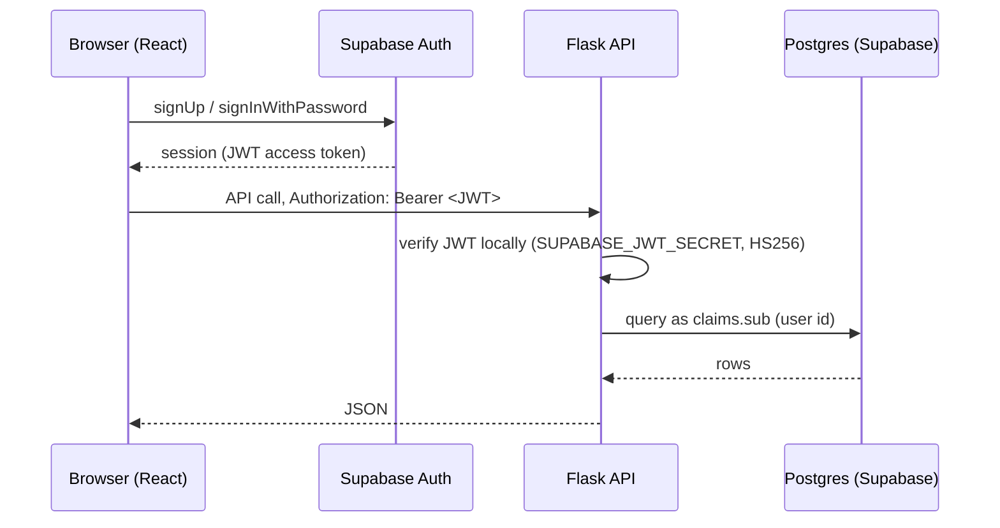

# Cloud9 Partners — Architecture & Plan

Last updated: 2026-07-22

## 1. What we're building

A two-sided marketplace for car buying in South Africa:

- **Buyers** sign up free, describe the car they want, pay an advisory fee
  (R500 consulting / R750 quote comparison), and either get coached by an
  advisor or receive competing quotes from approved dealers.
- **Sales reps** (dealership staff) apply with their dealership details. An
  **admin** reviews each application: approved reps get a unique rep code and
  can quote on open requests; rejected reps get emailed comments and can
  resubmit (per the profile-creation flowchart).

## 2. Stack and why

| Choice | Why |
| --- | --- |
| React + TypeScript + Vite | Fast dev server, typed UI, easy Vercel deploys. |
| Flask + SQLAlchemy | Simple, well-understood Python API; easy on Railway. |
| Supabase Auth | Free managed auth (email/password now, OTP/social later). No password handling in our code. |
| Supabase Postgres | Managed Postgres with a dashboard; same project as auth. |
| Railway | One-click Flask hosting with env vars and health checks. |
| PayFast | The standard SA gateway (card, EFT, SnapScan); sandbox for dev. Yoco can be added later. |

### Key design decision: all data goes through Flask

The browser talks to Supabase **only for auth** (sign up / sign in / session).
Every read/write of application data goes through the Flask API, which connects
directly to the Supabase Postgres database. RLS is enabled with **no policies**,
so the public anon key can't touch tables even if leaked. This keeps
authorization logic in one place (Flask decorators) instead of splitting it
between RLS policies and API code.

## 3. Auth flow



- `backend/app/auth.py` — `@require_auth` verifies the token; `@require_role("buyer"|"sales_rep"|"admin")`
  loads the profile and checks the role.
- The JWT `sub` claim **is** the `profiles.id`, so no lookup table is needed.
- Making your friend the admin: after they sign up, run once in Supabase SQL
  editor: `update profiles set role = 'admin' where email = '<their email>';`

## 4. Roles & the approval workflow (from the flowchart)

| Role | How created | Capabilities |
| --- | --- | --- |
| buyer | Signup wizard (auto-active) | Create requests, pay fees, view/accept quotes, track status |
| sales_rep | Signup + dealership form → **pending** | Once approved: see open quote-comparison requests, submit quotes |
| admin | Manually promoted in SQL | Approve/reject reps (with comments), see all requests, update statuses |

Sales-rep lifecycle: `pending → approved (rep_code issued, e.g. C9-4F7A2B)` or
`pending → rejected (comments stored, emailed) → resubmit → pending`. Endpoints:
`POST /api/sales-reps` (submit/resubmit), `POST /api/admin/sales-reps/<id>/approve|reject`.

## 5. Data model

```
profiles            id (= auth.users.id), role, first/last name, email, phone
sales_rep_profiles  profile_id → profiles, dealership_name, location,
                    status (pending/approved/rejected), review_comments, rep_code
service_requests    buyer_id → profiles, service_type, status, vehicle fields,
                    preferences (type/brands/budget/condition/finance/province/
                    timeline/contact), notes
quotes              request_id → service_requests, sales_rep_id → sales_rep_profiles,
                    price_cents, interest_rate, term_months, status
payments            request_id → service_requests, provider, amount_cents,
                    status, provider_reference
```

Request status machine:
`pending_payment → active (payment confirmed) → quoting (first quote in) → completed (quote accepted / consult done)`,
with `cancelled` reachable from any state. Money is stored in **cents** to avoid
floating point.

Schema source of truth: [`supabase/schema.sql`](../supabase/schema.sql). The
SQLAlchemy models in `backend/app/models.py` mirror it. When the schema changes,
update both (or adopt Alembic once churn justifies it).

## 6. API surface

```
GET  /api/health                                    liveness (Railway health check)
POST /api/profiles                                  create profile after signup
GET  /api/me                                        current profile (+ rep profile)

POST /api/requests                                  buyer: create request
GET  /api/requests                                  buyer: list own (admin: all)
GET  /api/requests/<id>                             detail + quotes
POST /api/requests/<id>/quotes/<qid>/accept         buyer: accept a quote

POST /api/sales-reps                                rep: submit/resubmit dealership
GET  /api/sales-reps/open-requests                  approved rep: open requests
POST /api/sales-reps/requests/<id>/quotes           approved rep: submit quote

GET  /api/admin/sales-reps?status=pending           admin: review queue
POST /api/admin/sales-reps/<id>/approve             admin: approve, issue rep_code
POST /api/admin/sales-reps/<id>/reject              admin: reject with comments
GET  /api/admin/requests                            admin: all requests
POST /api/admin/requests/<id>/status                admin: move status

POST /api/payments/initiate                         buyer: get signed PayFast form
POST /api/payments/notify                           PayFast ITN webhook
GET  /api/payments/<id>                             payment status
```

## 7. Payments (PayFast)

1. Wizard finishes → `POST /api/payments/initiate` creates a `payments` row and
   returns the PayFast process URL + signed fields.
2. Frontend auto-submits a hidden form → buyer pays on PayFast (sandbox in dev).
3. PayFast calls `/api/payments/notify` (ITN) server-to-server; we verify the
   signature, mark the payment `complete`, and flip the request to `active`.
4. Buyer lands back on `/payment/success` or `/payment/cancelled`.

**Before go-live:** validate ITNs against PayFast's validate endpoint + source
IPs (noted as TODO in `payments.py`), set the real merchant ID/key/passphrase as
Railway env vars, and test the full sandbox flow. The ITN URL must be publicly
reachable, so payment testing happens against the deployed backend (or a tunnel
like ngrok locally).

## 8. Deployment

### Supabase (once)
1. Create project → run `supabase/schema.sql` in the SQL editor.
2. Note: project URL, anon key, JWT secret (Settings → API), DB connection
   string (Settings → Database — use the **session pooler** URI for Railway).
3. Auth → Providers: keep Email enabled. For MVP you may disable "Confirm
   email" so signups work instantly; re-enable + configure SMTP before launch.

### Railway (backend)
1. Push this repo to GitHub → Railway → New Project → Deploy from repo.
2. Set **Root Directory** to `backend/`.
3. Env vars: `SECRET_KEY`, `DATABASE_URL`, `SUPABASE_URL`,
   `SUPABASE_JWT_SECRET`, `CORS_ORIGINS` (the frontend domain),
   `FRONTEND_URL`, `PAYFAST_*`.
4. `railway.json` already sets the gunicorn start command and `/api/health`
   health check. Railway gives you `https://<app>.up.railway.app`.

### Vercel (frontend)
1. Import repo → Root Directory `frontend/` → framework auto-detected (Vite).
2. Env vars: `VITE_SUPABASE_URL`, `VITE_SUPABASE_ANON_KEY`,
   `VITE_API_BASE_URL=https://<app>.up.railway.app`.
3. Add the Vercel domain to `CORS_ORIGINS` on Railway and as `FRONTEND_URL`.
4. Later: point `cloud9partners.co.za` at Vercel and add it to CORS too.

### Secrets policy
Real keys live **only** in `.env` files (gitignored) and Railway/Vercel env
vars. Your friend's PayFast merchant details, Supabase keys, etc. never get
committed. `.env.example` files document what's needed without values.

## 9. What's built vs. what's next

**Built now**
- Landing page, 4-step signup wizard (account → service → details → review/pay),
  sign in, buyer dashboard (request tracking), payment result pages.
- Flask API: auth, profiles, requests, quotes, rep registration + admin
  approval/rejection with comments and rep codes, PayFast initiate + ITN.
- Supabase schema with RLS lockdown; Railway config.

**Next (rough order)**
1. Supabase project + Railway/Vercel deploys (see §8) — makes it real.
2. Email notifications (approval/rejection, payment confirmation, new quote) —
   Resend or Supabase SMTP; the TODO hooks are in `admin.py`/`payments.py`.
3. Sales-rep UI: dealership signup form, "open requests" list, quote submission
   (API already exists — needs pages).
4. Admin UI: pending-rep review queue, request pipeline (API exists).
5. Quote comparison view for buyers (side-by-side, total cost of credit).
6. Chat with agents (flowchart mentions it) — start with WhatsApp deep links
   (`wa.me/<number>`); real-time chat (Supabase Realtime) only if needed.
7. Payment-confirmation upload (flowchart) — Supabase Storage bucket.
8. Yoco as a second payment option.
9. Hardening: rate limiting (flask-limiter), Sentry, ITN validation, pytest
   suite for the approval and payment state machines.

## 10. Costs (indicative, MVP)

| Service | Cost |
| --- | --- |
| Supabase free tier | R0 (500MB DB, 50k MAU auth) |
| Railway | ~$5/mo usage-based |
| Vercel hobby | R0 |
| PayFast | No monthly fee; ~3.2% + R2 per card transaction |
| Domain (.co.za) | ~R100/yr |
